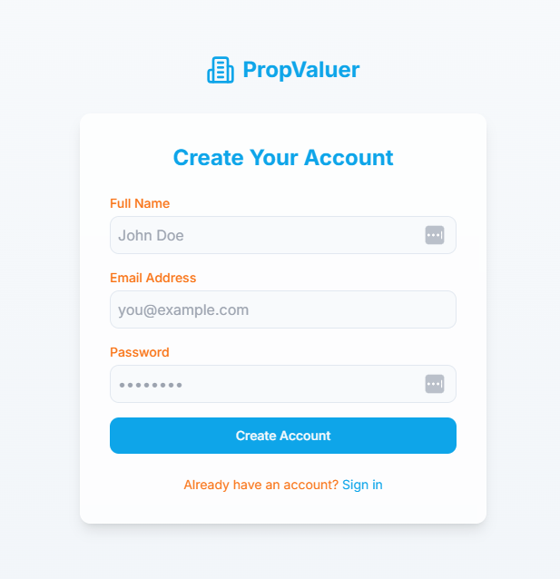

# Propvaluer-HQ assessment

- Match the colors and UI changes on the landing page as well as the sign up and sign in pages via the buttons in the top right of the landing page.
- Make a component of the card element on the main landing page (the 3 cards at the bottom). Repeat the component for all 3 existing cards so that it looks the same but they are now a repeatable component.

## Before

## After

